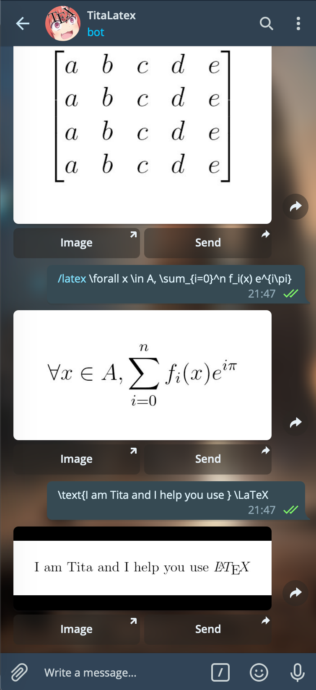

# TitaLatexBot
Telegram Bot that receive an LaTeX equation and send it back as an image. You can make your own instance of the bot, and add your owns changes, or use the version I host myself : [TitaLatexBot](https://t.me/titalatexbot).

This is developed with [pyTelegramBotAPI](https://github.com/eternnoir/pyTelegramBotAPI) using the listener mechanism. This fork has been modified for my own usage, because I could not find a latex bot still working.

## Required packages

You need to install previously **libwebp**, **Pillow** and **pyTelegramBotAPI**. It's very important you get libwebp **BEFORE** pillow (or you can re-install pillow after installing libwebp). You can get them using your package manager.

In Archlinux
```
pacman -S libwebp python-pillow
```

In Debian-based distros
```
apt-get install libwebp2 libwebp-dev
```

On MacOs
```
brew install webp
```

Using pip
```
python3 -m pip install --upgrade Pillow
python3 -m pip install --upgrade pyTelegramBotAPI
```

## Usage

1. Create a bot with the [BotFather](https://t.me/botfather) Telegram Bot
	- To enable inline mode, use ```/setinline ```
2. Write the token in token.txt file
3. Execute the bot in your server with ```./bot.py```
4. In the Telegram client you can talk with your bot or add them to groups. All messages beggining with **/latex** will be catched by the bot. You can also use the inline mode with @nameofthebot.

For some functionalities to work, you need an http access to the downloaded images (the "results" folder). Write the url of the server in expose_url.txt. The images must be accessible at your_exposed_url/results/image_filename.

### Usage of the bot

- Send latex code or use the ```/latex``` command to generate images when talking to the bot
	- You can then send the image to other users
- Use ```/latex``` in group chats
- Type ```@nameofthebot``` in any chat, and then :
	- Leave empty and click on an image to send a latex code recently sent to the bot
	- Or type a latex expression


## Example



Enjoy it!

## About

Current developer : Théophane Vallaeys ([webalorn](https://github.com/webalorn))

I made this bot from [LaTeX2IMGbot](https://github.com/analca3/LaTeX2IMGbot) by [analca3](https://github.com/analca3). But since there were bugs and many limitations, I made created TitaLatex.

(And Tita is just the name I give to all my bots)