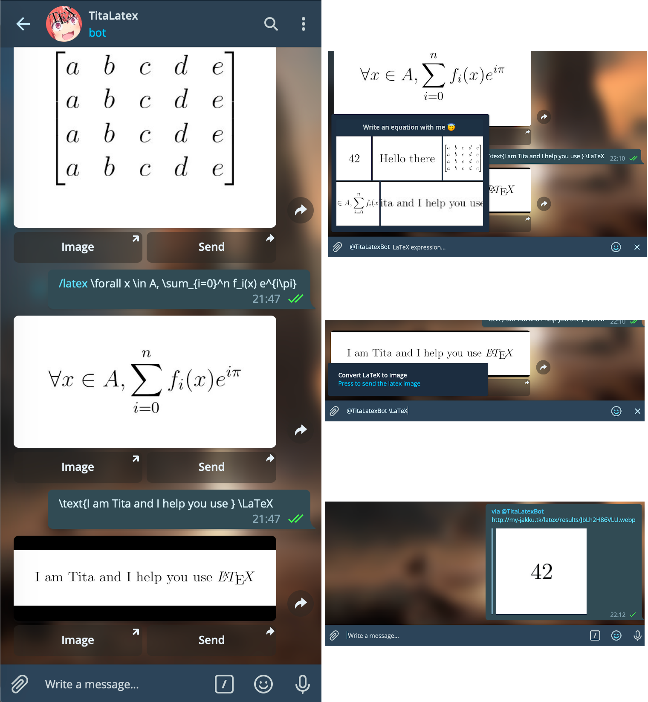

# TitaLatexBot
Telegram Bot that receive an LaTeX equation and send it back as an image. You can make your own instance of the bot, and add your owns changes, or use the version I host myself : [TitaLatexBot](https://t.me/titalatexbot).

This is developed with [pyTelegramBotAPI](https://github.com/eternnoir/pyTelegramBotAPI) using the listener mechanism. This fork has been modified for my own usage, because I could not find a latex bot still working.

## Required packages

You need to install previously **Pillow**, and **pyTelegramBotAPI**. You can install them with pip.

```bash
python3 -m pip install --upgrade pyTelegramBotAPI pillow
```

The bot can render latex locally, or by using a remote API (but the API have more limitations). In both case, you will need to specify the option you choosed in ```conf.json```.

### Compiling locally

In the first case, you need to install a latex distribution, the package ```dvipng```, and the python package ```unidecode```. On debian-based distros, you can use :

```bash
apt-get install dvipng texlive texlive-latex-extra texlive-science
```

You can check if the latex installation is working correctly for the bot with :
```bash
latex -src -interaction=nonstopmode template.tex
dvipng -T tight -D 600 template.dvi -o template.png
```

If you have an image named ```template.png``` displaying ```<template>```, it should be ok.

### Using the remote API

With the remote API, you will juste need the python package ```unidecode```, because the API doesn't works with accents.

```bash
python3 -m pip install --upgrade unidecode
```

## Usage

1. Create a bot with the [BotFather](https://t.me/botfather) Telegram Bot
	- To enable inline mode, use ```/setinline ```
2. Write configuration in ```conf.json``` (see below)
3. Execute the bot in your server with ```./bot.py```
4. In the Telegram client you can talk with your bot or add them to groups. All messages beggining with **/latex** will be catched by the bot. You can also use the inline mode with @nameofthebot.

For some functionalities to work, you need an http access to the downloaded images (the "results" folder). Write the url of the server in expose_url.txt. The images must be accessible at your_exposed_url/results/image_filename.

### Configuration

You must write your configuration in ```conf.json``` in the following format. ```expose_url``` is optional and can be leaved empty, or removed. Theses are the settings I use, except, of course, for ```token``` and ```expose_url```.

```json
{
	"token" : "your_bot_access_token",
	"use_local_latex" : true,
	"expose_url" : "http://you_domain/subdirs/",
	"nb_recent_items" : 5,
	"latex_dpi" : 350,
	"image_border" : 40
}
```

- token : **[required]**
- use_local_latex : **[required]** ```true``` if you want to compile latex using your server latex distribution, ```false``` if you want to use the remote API.
- expose_url : *[optional]* Url to access the generated images.
- nb_recent_items : *[optional]* Number of recent latex images shown by the bot in inline mode.
- latex_dpi : *[optional]* Affects the quality of the latex images.
- image_border : *[optional]*

### Usage of the bot

- Send latex code or use the ```/latex``` command to generate images when talking to the bot
	- You can then send the image to other users
- Use ```/latex``` in group chats
- Type ```@nameofthebot``` in any chat, and then :
	- Leave empty and click on an image to send a latex code recently sent to the bot
	- Or type a latex expression


## Example



Enjoy it!

## About

Current developer : Théophane Vallaeys ([webalorn](https://github.com/webalorn))

I made this bot from [LaTeX2IMGbot](https://github.com/analca3/LaTeX2IMGbot) by [analca3](https://github.com/analca3). Since there were bugs and many limitations, I created TitaLatex. Most of the code has been rewriten. Most of the code is new.

(And Tita is just the name I give to all my bots)